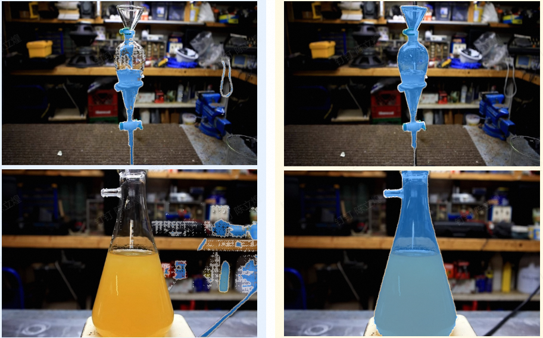

# Overview
Based on [SAM2](https://github.com/facebookresearch/sam2), scripts for prediction, training, validation, and evaluation using SAM2 on the [LabPicsV1 dataset](https://zenodo.org/records/3697452/files/LabPicsV1.zip?download=1) have been implemented, including both prompt and no-prompt scenarios.

Configuration can be referenced from [SAM2](https://github.com/facebookresearch/sam2).

# Technology
* **Freezing**: The `image encoder` and `prompt encoder` are frozen because they have already learned good feature extraction capabilities for images and prompts. Freezing them can speed up computation.
* **Cosine Learning Rate Scheduler**: The learning rate will decrease and then increase along a cosine curve with epochs. The maximum and minimum values are the `lr` filled in the optimizer and the `eta_min` filled in the scheduler, respectively. `T_max` refers to half a period of the cosine curve (from the maximum value to the minimum value).
* **Mixed Precision Training**: `with autocast('cuda', torch.float16):` allows the forward pass to use FP16 precision to speed up computation. The gradient updates during the backward pass will revert to FP32 precision to ensure accuracy.
* **Visualization**: TensorBoard is implemented to visualize variables during the training process (such as loss and learning rate). During training, run `tensorboard --logdir=relative_log_path` in the terminal, then enter the provided IP address in the browser to see the interface as shown below.
* **Gradient Accumulation**: To simulate large-batch training effects when dealing with large models or limited GPU memory, gradients are accumulated over `accumulation_steps` before updating.
* **Loss Functions**: dice, focal, dIoU, IoU; **Evaluation Metrics**: dice, IoU, pixel accuracy (PA), Boundary F1-score.

# Structure
All modifications are under the `training` folder:
* `dataset.py`: LabPics dataset;
* `loss_fn.py`: Loss functions;
* `metric.py`: Evaluation metrics;
* `predict.py`: Prediction script for a single image;
* `seg_all.py`: Segment the entire image for a single image;
* `test.py`: Evaluation script to assess model weights using the test set;
* `train-old.py`: Old version of the training script;
* `train.py`: Training script;