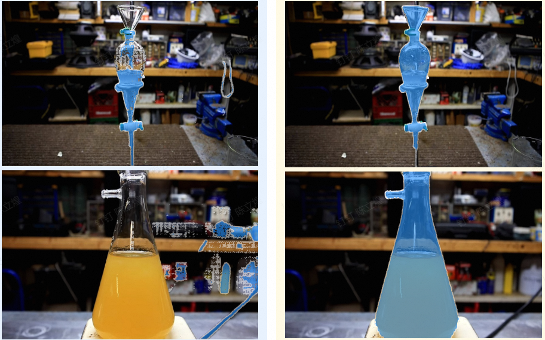

# 概述
基于[SAM2](https://github.com/facebookresearch/sam2)，使用[LabPicsV1数据集](https://zenodo.org/records/3697452/files/LabPicsV1.zip?download=1)和[ADE20K数据集](http://data.csail.mit.edu/places/ADEchallenge/ADEChallengeData2016.zip)实现了使用SAM2进行预测、训练、验证、评估的脚本，包括有prompt和无prompt情况。

配置参考[SAM2](https://github.com/facebookresearch/sam2)即可。

# 技术
*   冻结：冻结了`image encoder`和`prompt encoder`，因为编码器已经学习到不错的图片和提示抽特征能力了，冻结它们可以加快计算。
*   余弦学习率调度器：学习率将随着epoch按余弦曲线下降后上升，最值是优化器`optimizer`填入的`lr`和调度器`scheduler`填入的`eta_min`，`T_max`指的是余弦的半个周期（最大值降到最小值）。
*   混合精度训练：` with autocast('cuda', torch.float16):`可以使得前向传播时使用FP16精度，加快速度。反向传播梯度更新时恢复到FP32精度保证准确性。
*   可视化：实现了用tensorboard对训练过程的变量（损失、学习率等）进行可视化（如下图）。训练过程中，在终端运行`tensorboard --logdir=日志相对位置`，然后浏览器进入给你的IP地址就可以看到以下界面。
*   梯度累积：为了在处理大模型或有限的 GPU 内存时，模拟大批次的训练效果，多次反向传播得到的梯度积累`accumulation_steps`步后再进行更新。
*   损失函数：dice、focal、dIoU、IoU；评估指标：dice、IoU、像素准确度（PA）、Boundary F1-score。

# 结构
改动都在training文件夹下：
- dataset.py：数据集;
- loss_fn.py：损失函数；
- metric.py：评估指标；
- predict.py：预测脚本，预测单张图片；
- seg_all.py：分割全图，单张图片；
- test.py：评估（测试）脚本，用测试集评估某个模型权重；
- train-old.py：老版本训练脚本；
- train.py：训练脚本；